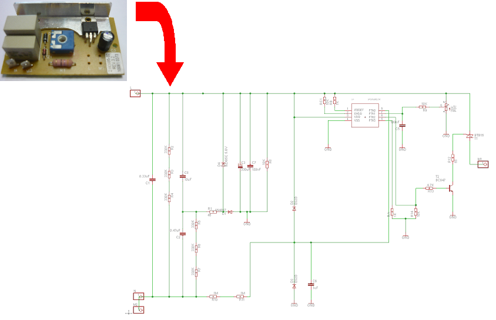

#UnPCB
This program can be used as a tool for helping in reverse engineering printed circuit boards (PCB).
It's written in Visual Basic 2008 and helps converting scanned PCB images (top and bottom) to Cadsoft Eagle schematic file.
Also includes code to read Eagle .lbr files into a Visual Basic project and display the symbol on the screen.

You can download a tutorial [here](tutorial/tutorial.pdf).
If you are looking for just the executable, this can be downloaded [here](app/unpcb.zip).
Don't forget to install the [.NET framework from Microsoft](https://www.microsoft.com/en-us/download/details.aspx?id=30653) if you don't have it installed yet.